# Laporan Proyek Machine Learning - Ivan Jaelani Besti

## Domain Proyek

Diabetes mellitus merupakan salah satu penyakit kronis paling umum di dunia, dengan dampak jangka panjang yang serius terhadap kesehatan jika tidak terdeteksi dan ditangani sejak dini. Organisasi Kesehatan Dunia (WHO) mencatat peningkatan kasus diabetes secara global dari tahun ke tahun, menandakan urgensi dalam pengembangan solusi diagnosis yang lebih cepat dan akurat. Diagnosis dini sangat penting untuk mencegah komplikasi serius seperti penyakit jantung, gagal ginjal, dan kebutaan.

Namun, metode diagnosis tradisional seperti tes darah laboratorium membutuhkan waktu dan sumber daya medis yang tidak selalu tersedia, terutama di daerah dengan akses kesehatan terbatas. Oleh karena itu, penerapan teknologi machine learning dalam klasifikasi data medis menjadi pendekatan yang sangat relevan dan potensial. Dengan kemampuan untuk mempelajari pola dari data pasien, machine learning dapat digunakan untuk memprediksi kemungkinan diabetes secara otomatis, cepat, dan relatif murah.

Studi terkini menunjukkan bahwa berbagai algoritma machine learning seperti logistic regression, support vector machine, decision tree, dan random forest telah berhasil digunakan dalam sistem deteksi dini diabetes dengan tingkat akurasi yang tinggi. Ini adalah ([Das et al., 2023](https://doi.org/10.1109/IEMENTech60402.2023.10423472)), ([Sinha et al., 2024](https://doi.org/10.1109/ICAAIC60222.2024.10575581)), dan ([Alzboon et al., 2023](https://doi.org/10.3991/ijoe.v19i15.42417)).

Dengan memanfaatkan dataset seperti Pima Indian Diabetes Dataset yang telah banyak digunakan dalam penelitian, proyek ini bertujuan mengembangkan sistem klasifikasi diabetes berbasis machine learning yang dapat membantu tenaga medis dalam membuat keputusan awal secara lebih objektif dan efisien.

### Referensi
- Das, S., Ghosh, S., Kumar, S., Ganguly, G., & Devi, G. U. (2023). *Diabetes Detection System using Machine Learning*. 2023 7th International Conference on Electronics, Materials Engineering & Nano-Technology (IEMENTech). https://doi.org/10.1109/IEMENTech60402.2023.10423472
- Sinha, R., Vennela, B. S., & Babu, S. (2024). *Early Diabetes Prediction using Machine Learning Algorithms*. 2024 3rd International Conference on Applied Artificial Intelligence and Computing (ICAAIC). https://doi.org/10.1109/ICAAIC60222.2024.10575581
- Alzboon, M. S., Al-Batah, M. S., Alqaraleh, M., Abuashour, A., & Bader, A. F. H. (2023). *Early Diagnosis of Diabetes: A Comparison of Machine Learning Methods*. International Journal of Online and Biomedical Engineering (iJOE). https://doi.org/10.3991/ijoe.v19i15.42417

## Business Understanding

### Problem Statements
Diabetes merupakan penyakit kronis yang prevalensinya terus meningkat di seluruh dunia. Deteksi dini terhadap diabetes sangat penting karena dapat mengurangi risiko komplikasi serius. Namun, pemeriksaan medis konvensional sering kali memerlukan waktu, biaya, dan akses ke fasilitas kesehatan yang memadai, yang belum tentu tersedia untuk semua lapisan masyarakat.

Permasalahan yang dihadapi adalah bagaimana membangun sebuah sistem yang mampu melakukan deteksi dini diabetes secara otomatis dan efisien berdasarkan data klinis dasar, agar dapat membantu proses diagnosis awal, terutama di daerah dengan keterbatasan sumber daya medis.

### Goals
Tujuan dari proyek ini adalah untuk membangun model machine learning yang mampu mengklasifikasikan apakah seseorang mengidap diabetes atau tidak, berdasarkan data seperti kadar glukosa, tekanan darah, indeks massa tubuh, usia, dan variabel relevan lainnya. Sistem ini diharapkan dapat menjadi alat bantu yang efektif dalam proses skrining awal terhadap diabetes.

### Solution Statement
Untuk mencapai tujuan di atas, solusi yang diusulkan meliputi:

1. **Membangun model klasifikasi menggunakan algoritma Logistic Regression** sebagai baseline model karena sifatnya yang sederhana dan interpretatif.
2. **Menguji alternatif algoritma seperti Random Forest atau Support Vector Machine (SVM)** yang memiliki performa tinggi pada berbagai studi klasifikasi medis.
3. **Mengukur performa model menggunakan metrik evaluasi** seperti akurasi, precision, recall, dan f1-score untuk menentukan model terbaik.

Pendekatan ini memastikan bahwa solusi yang dikembangkan tidak hanya efektif, tetapi juga terukur dan dapat dijelaskan secara statistik.

## Data Understanding

Dataset yang digunakan dalam proyek ini adalah **Pima Indians Diabetes Dataset**, yang berisi data rekam medis pasien perempuan keturunan Indian Pima berusia 21 tahun ke atas. Dataset ini sangat populer dalam studi deteksi dini diabetes dan tersedia secara publik melalui platform Kaggle:  
📎 [Pima Indians Diabetes Dataset - Kaggle](https://www.kaggle.com/datasets/uciml/pima-indians-diabetes-database)

Dataset ini terdiri dari **768 data observasi** dengan **8 fitur input numerik** dan **1 target output** (`Outcome`), yang menunjukkan apakah seseorang mengidap diabetes (1) atau tidak (0).

### Variabel-variabel pada dataset adalah sebagai berikut:
- **Pregnancies**: Jumlah kehamilan yang pernah dialami pasien.
- **Glucose**: Kadar glukosa plasma dalam darah (mg/dL).
- **BloodPressure**: Tekanan darah diastolik (mm Hg).
- **SkinThickness**: Ketebalan lipatan kulit triceps (mm).
- **Insulin**: Konsentrasi insulin dalam serum (mu U/ml).
- **BMI**: Body Mass Index (kg/m²), mengukur berat badan relatif terhadap tinggi badan.
- **DiabetesPedigreeFunction**: Skor fungsi silsilah diabetes, mengindikasikan faktor genetik.
- **Age**: Usia pasien (tahun).
- **Outcome**: Nilai 1 jika pasien terdiagnosis diabetes, dan 0 jika tidak.

### Tahapan Exploratory Data Analysis (EDA)
Untuk memahami data lebih dalam, beberapa langkah eksplorasi dilakukan, di antaranya:

- **Mengecek Informasi & Statistik Deskriptif Dataset**: Menggunakan `.info` dan `.describe` untuk mengetahui informasi awal dan statistik deskriptif dari dataset.
- **Cek Missing Values**: Mengevaluasi jumlah nilai 0 pada kolom seperti `Glucose`, `Insulin`, dan `SkinThickness`, yang bisa jadi merupakan data tidak tercatat (proxy untuk null).
- **Pengecekan Duplicate Values**: Mengevaluasi dataset apakah mengandung data duplikat yang dapat memengaruhi hasil akhir dari model.
- **Visualisasi**: Histogram dan boxplot digunakan untuk mendeteksi outlier dan distribusi dari fitur-fitur numerik, serta mengecek korelasi antar fitur menggunakan heatmap.

### Informasi Dataset
```
<class 'pandas.core.frame.DataFrame'>
RangeIndex: 768 entries, 0 to 767
Data columns (total 9 columns):
 #   Column                    Non-Null Count  Dtype  
---  ------                    --------------  -----  
 0   Pregnancies               768 non-null    int64  
 1   Glucose                   768 non-null    int64  
 2   BloodPressure             768 non-null    int64  
 3   SkinThickness             768 non-null    int64  
 4   Insulin                   768 non-null    int64  
 5   BMI                       768 non-null    float64
 6   DiabetesPedigreeFunction  768 non-null    float64
 7   Age                       768 non-null    int64  
 8   Outcome                   768 non-null    int64  
dtypes: float64(2), int64(7)
memory usage: 54.1 KB
```
Dataset ini terdiri dari 768 entri dan 9 kolom. Semua kolom tidak mengandung nilai yang hilang. Tipe data untuk mayoritas kolom adalah integer, kecuali kolom **DiabetesPedigreeFunction**, yang memiliki tipe data float.

```
	Pregnancies	Glucose	BloodPressure	SkinThickness	Insulin	BMI	DiabetesPedigreeFunction	Age	Outcome
count	768.000000	768.000000	768.000000	768.000000	768.000000	768.000000	768.000000	768.000000	768.000000
mean	3.845052	120.894531	69.105469	20.536458	79.799479	31.992578	0.471876	33.240885	0.348958
std	3.369578	31.972618	19.355807	15.952218	115.244002	7.884160	0.331329	11.760232	0.476951
min	0.000000	0.000000	0.000000	0.000000	0.000000	0.000000	0.078000	21.000000	0.000000
25%	1.000000	99.000000	62.000000	0.000000	0.000000	27.300000	0.243750	24.000000	0.000000
50%	3.000000	117.000000	72.000000	23.000000	30.500000	32.000000	0.372500	29.000000	0.000000
75%	6.000000	140.250000	80.000000	32.000000	127.250000	36.600000	0.626250	41.000000	1.000000
max	17.000000	199.000000	122.000000	99.000000	846.000000	67.100000	2.420000	81.000000	1.000000
```

Tabel statistik deskriptif memberikan gambaran mengenai distribusi fitur numerik dalam dataset. Beberapa informasi yang menarik dari statistik deskriptif ini adalah:
- Kolom **Glucose** memiliki nilai rata-rata sekitar 120, dengan nilai minimum 0 yang menunjukkan kemungkinan adanya data yang perlu ditangani (misalnya, nilai 0 bisa berarti data hilang atau tidak valid).
- Kolom **Insulin** juga memiliki nilai minimum 0, yang menunjukkan adanya kemungkinan nilai 0 pada data yang memerlukan penanganan khusus.
- Kolom **BMI** memiliki rata-rata sekitar 31, dengan nilai maksimum hingga 67, yang menunjukkan rentang variasi yang cukup besar dalam data.

Beberapa fitur perlu dinormalisasi agar tidak menimbulkan bias.

### Verifikasi Nilai Kosong
Dataset **tidak memiliki missing values** secara eksplisit berdasarkan hasil pengecekan menggunakan `.isnull().sum()`. Namun, beberapa fitur seperti `Glucose`, `Insulin`, dan `SkinThickness` memiliki banyak nilai nol yang dalam konteks medis bisa mencerminkan data yang tidak tercatat. Karena nilai-nilai tersebut memang menjadi bagian dari karakteristik dataset asli, tidak dilakukan imputasi atau penghapusan.

```python
# Verifikasi Missing Values
print("Missing values per column:")
print(df.isnull().sum())
```
```bash
Missing values per column:
Pregnancies                 0
Glucose                     0
BloodPressure               0
SkinThickness               0
Insulin                     0
BMI                         0
DiabetesPedigreeFunction    0
Age                         0
Outcome                     0
dtype: int64
```

### Verifikasi Nilai Duplikat
```
Jumlah baris duplikat: 0
Baris duplikat:
Empty DataFrame
Columns: [Pregnancies, Glucose, BloodPressure, SkinThickness, Insulin, BMI, DiabetesPedigreeFunction, Age, Outcome]
Index: []
```

Dapat dilihat bahwa dataset yang dipakai pada proyek saat ini tidak mengandung data duplikat. Sehingga tahapan proyek dapat dilanjutkan ke tahap pengecekan distribusi data dan pengecekan nilai outlier


### Analisis Distribusi, Outlier, Korelasi 

#### Distribusi
Hasil visualisasi histogram menunjukkan bahwa beberapa fitur seperti `Pregnancies`, `Insulin`, dan `Age` memiliki distribusi miring (skewed), sementara fitur seperti `BMI` dan `Glucose` lebih mendekati distribusi normal.  
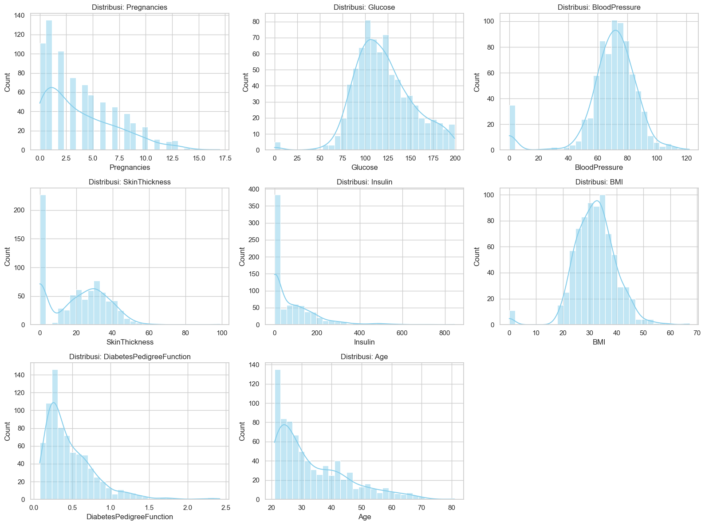

#### Boxplot
Boxplot menunjukkan keberadaan **outlier** pada fitur `Insulin`, `SkinThickness`, dan `DiabetesPedigreeFunction`.
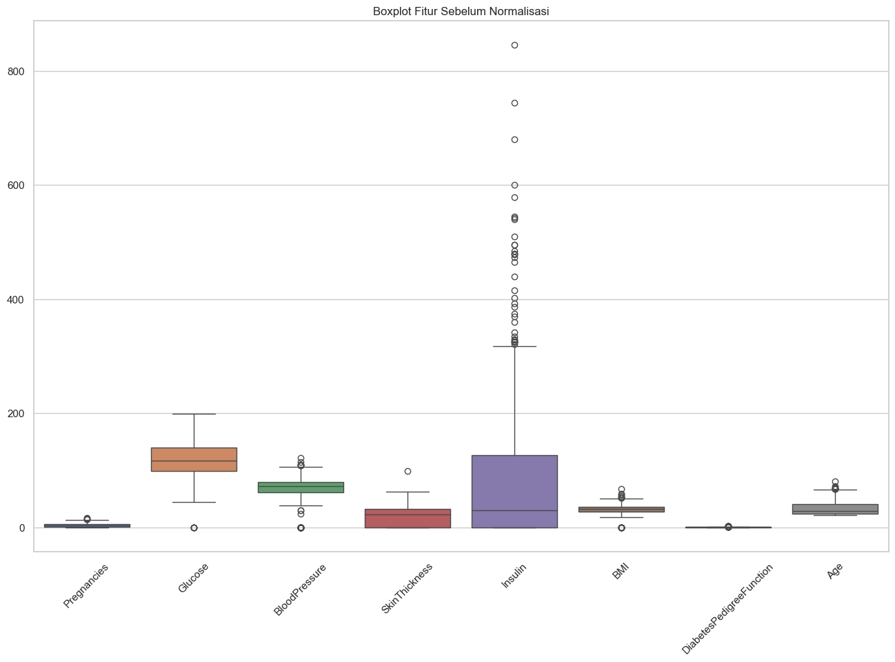

Namun, karena tujuan dari proyek ini adalah **deteksi diabetes**, maka outlier **tidak dihapus** karena bisa merepresentasikan kondisi medis yang valid dan penting (misalnya kadar glukosa sangat tinggi atau pasien dengan riwayat keluarga kuat).

#### Matriks Korelasi

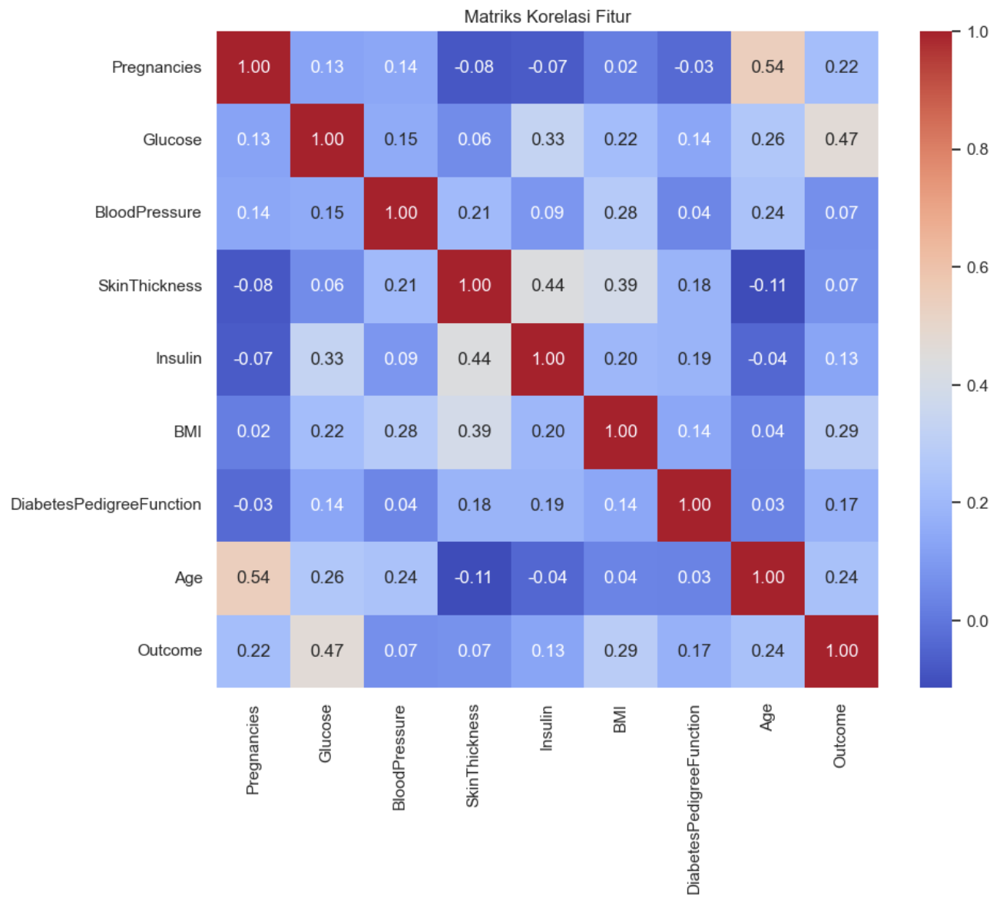
- Fitur **Glucose** memiliki korelasi paling tinggi terhadap target `Outcome` (**r = 0.47**), menunjukkan bahwa kadar glukosa darah sangat mempengaruhi klasifikasi diabetes.
- **BMI** dan **Age** juga memiliki korelasi sedang terhadap `Outcome`.
- Sebagian besar fitur lainnya menunjukkan korelasi rendah satu sama lain, mengindikasikan rendahnya multikolinearitas.


Langkah-langkah ini penting untuk mengidentifikasi kebutuhan data cleaning dan normalisasi pada tahap selanjutnya.

## Data Preparation

Tahap ini bertujuan untuk menyiapkan data sebelum digunakan dalam proses pelatihan model machine learning. Berdasarkan hasil eksplorasi awal (EDA) di tahap Data Understanding, terdapat beberapa hal yang perlu diperhatikan dalam proses ini, seperti distribusi fitur yang tidak seragam, dan perbedaan skala antar fitur pada tahap Data Understanding. Oleh karena itu tahap ini akan dilanjutkan dengan proses normalisasi, dan splitting data.

### Normalisasi Data
Skala antar fitur sangat bervariasi, misalnya kadar `Glucose` berkisar antara 0 hingga 200, sementara `DiabetesPedigreeFunction` hanya berkisar 0 hingga 2. Untuk menghindari bias model terhadap fitur dengan skala besar, dilakukan proses **normalisasi menggunakan StandardScaler**.
```python
# Statistik deskriptif untuk fitur numerik
df.describe()
```
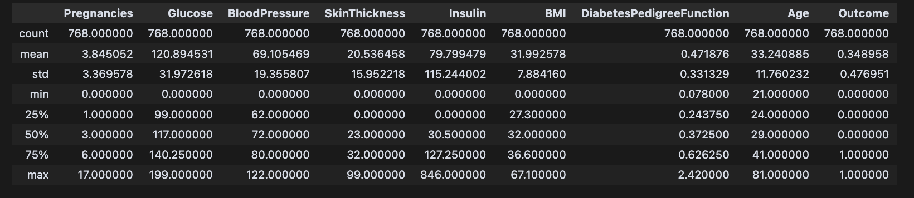

```python
# Normalisasi Data
scaler = StandardScaler()
features = df.drop(columns=['Outcome'])
scaled_features = scaler.fit_transform(features)
scaled_df = pd.DataFrame(scaled_features, columns=features.columns)
scaled_df['Outcome'] = df['Outcome']
```
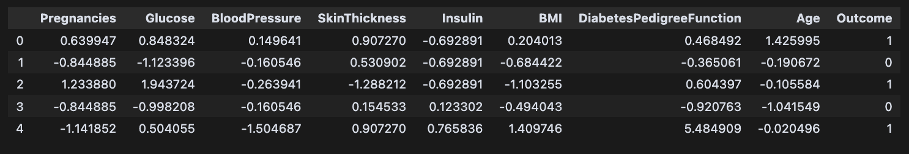

### Splitting Dataset
Dataset dibagi menjadi 80% data latih dan 20% data uji. Data latih digunakan untuk membangun model, sementara data uji digunakan untuk mengevaluasi kinerja model. Pembagian ini memastikan bahwa model dapat diuji dengan data yang tidak pernah dilihat sebelumnya, memberikan gambaran yang lebih akurat tentang kemampuan generalisasi model.

```python
# Pemisahan Data menjadi Training dan Test Set
X = scaled_df.drop(columns=['Outcome'])  # Fitur
y = scaled_df['Outcome']  # Target
```
```python
# Membagi data menjadi 80% training dan 20% test
X_train, X_test, y_train, y_test = train_test_split(X, y, test_size=0.2, random_state=42)
```
```bash
Ukuran data latih: 614 | Ukuran data uji: 154
```

## Modeling

Tahap modeling bertujuan untuk membangun dan mengevaluasi model machine learning yang mampu mengklasifikasikan apakah seseorang mengidap diabetes berdasarkan data medis yang tersedia. Beberapa algoritma dikembangkan dan dibandingkan berdasarkan metrik evaluasi untuk menentukan model terbaik secara objektif.

### Algoritma yang Digunakan

Tiga algoritma klasifikasi digunakan dalam proyek ini. Pemilihan algoritma ini dilakukan berdasarkan kesesuaiannya dengan karakteristik data dan popularitasnya dalam studi diagnosis medis:

#### 1. **Logistic Regression** 

**Logistic Regression** adalah model klasifikasi yang digunakan untuk memprediksi probabilitas suatu kejadian dengan menggunakan fungsi logistik (sigmoid). Fungsi ini memetakan output ke dalam rentang 0 hingga 1, yang dapat diinterpretasikan sebagai probabilitas kelas positif. Model ini mengasumsikan hubungan linear antara fitur dan log-odds dari probabilitas kelas positif. Formula untuk prediksi probabilitas adalah:  
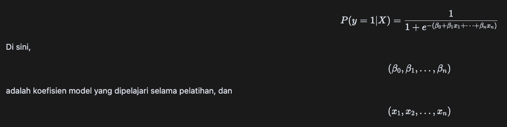

adalah fitur input. Model ini menggunakan fungsi log-likelihood untuk mengoptimalkan koefisien selama proses pelatihan.
   - **Kelebihan**: Cepat dilatih, menghasilkan output probabilistik, mudah diinterpretasikan, dan sangat cocok untuk klasifikasi biner.
   - **Kekurangan**: Terbatas dalam menangani relasi non-linear antar fitur.

#### 2. **Random Forest**

**Random Forest** adalah metode ensemble yang membangun banyak pohon keputusan (decision trees) dan menggabungkan hasil prediksi mereka untuk menghasilkan keputusan akhir. Setiap pohon dibangun menggunakan subset acak dari data dan fitur untuk mengurangi overfitting dan meningkatkan generalisasi. Proses pelatihan melibatkan pemilihan subset acak dari data dan pemilihan acak fitur pada setiap split pohon. Hasil prediksi untuk klasifikasi diambil dengan **voting** mayoritas dari semua pohon, sedangkan untuk regresi menggunakan rata-rata dari hasil pohon. Proses ini dapat digambarkan dengan formula berikut:  
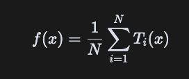  
Di mana \( f(x) \) adalah prediksi akhir, \( N \) adalah jumlah pohon dalam hutan, dan \( T_i(x) \) adalah prediksi dari pohon ke-i untuk input \( x \).
   - **Kelebihan**: Mampu menangani outlier dan relasi non-linear, serta tahan terhadap overfitting.
   - **Kekurangan**: Lebih kompleks, lebih sulit dijelaskan kepada pihak non-teknis, dan bisa kurang efisien saat fitur tidak relevan.

#### 3. **Support Vector Machine (SVM)**
**Support Vector Machine (SVM)** adalah algoritma klasifikasi yang memetakan data ke ruang vektor berdimensi lebih tinggi dan mencari **hyperplane** yang memaksimalkan margin antara dua kelas. Dalam SVM, tujuan utama adalah menemukan hyperplane yang memisahkan dua kelas dengan margin terbesar. Formula untuk mencari hyperplane yang optimal adalah sebagai berikut:  
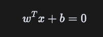  
Di sini, \( w \) adalah vektor bobot, \( b \) adalah bias, dan \( x \) adalah input data. SVM juga menggunakan fungsi kernel untuk mengubah data ke ruang yang lebih tinggi jika data tidak dapat dipisahkan secara linear. Fungsi kernel yang umum digunakan termasuk linear, polinomial, dan Gaussian Radial Basis Function (RBF). 
SVM berfokus pada **support vectors**, yaitu data titik yang paling dekat dengan hyperplane, yang menentukan margin.
   - **Kelebihan**: Efektif untuk dataset berdimensi menengah dan mampu membangun margin klasifikasi yang kuat.
   - **Kekurangan**: Komputasi relatif mahal dan tidak menghasilkan probabilitas secara langsung.

### Proses Pemodelan

Seluruh model dilatih menggunakan data latih (`X_train`, `y_train`) dan dievaluasi dengan data uji (`X_test`, `y_test`). Model dijalankan dengan parameter default sebagai baseline tanpa tuning agar perbandingan awal adil dan konsisten. 

Berikut adalah parameter yang digunakan:

- **Logistic Regression**: `random_state=42`
Parameter `random_state` digunakan untuk memastikan bahwa proses yang melibatkan elemen acak, seperti pembagian data atau inisialisasi model, menghasilkan hasil yang konsisten setiap kali kode dijalankan. Dengan menetapkan `random_state=42`, akan menjamin bahwa eksperimen dapat direproduksi dengan hasil yang sama. Angka 42 sering digunakan sebagai nilai default karena referensi budaya populer, namun angka lain juga dapat digunakan selama konsisten.
- **Random Forest**: `random_state=42`
Meskipun SVM dengan kernel RBF tidak selalu memerlukan parameter random_state, menetapkannya dapat membantu dalam proses seperti pembagian data atau validasi silang, memastikan hasil yang konsisten dan dapat direproduksi. Parameter `random_state` digunakan untuk memastikan bahwa proses yang melibatkan elemen acak, seperti pembagian data atau inisialisasi model, menghasilkan hasil yang konsisten setiap kali kode dijalankan.
- **SVM**: `kernel='rbf'`, `random_state=42`
Parameter `kernel='rbf'` (Radial Basis Function) digunakan dalam Support Vector Machine (SVM) untuk menangani data yang tidak dapat dipisahkan secara linear. Kernel RBF memetakan data ke ruang berdimensi lebih tinggi, memungkinkan model menemukan batas keputusan yang kompleks. Ini sangat berguna dalam kasus di mana hubungan antara fitur dan label tidak linear. Parameter `random_state` digunakan untuk memastikan bahwa proses yang melibatkan elemen acak, seperti pembagian data atau inisialisasi model, menghasilkan hasil yang konsisten setiap kali kode dijalankan.

```python
# Inisialisasi model
models = {
    "Logistic Regression": LogisticRegression(random_state=42),
    "Random Forest": RandomForestClassifier(random_state=42),
    "SVM": SVC(kernel='rbf', random_state=42)
}

# Pelatihan dan evaluasi
for name, model in models.items():
    model.fit(X_train, y_train)
    y_pred = model.predict(X_test)

    accuracy = accuracy_score(y_test, y_pred)
    precision = precision_score(y_test, y_pred)
    recall = recall_score(y_test, y_pred)
    f1 = f1_score(y_test, y_pred)
    cm = confusion_matrix(y_test, y_pred)

    results[name] = [accuracy, precision, recall, f1]
    conf_matrices[name] = cm
```

### Hasil Evaluasi

Evaluasi dilakukan menggunakan empat metrik utama klasifikasi:

- **Accuracy**: Proporsi prediksi yang benar terhadap total data.
- **Precision**: Proporsi prediksi positif yang benar-benar positif.
- **Recall**: Proporsi kasus positif yang berhasil dikenali.
- **F1-Score**: Rata-rata harmonis antara precision dan recall.

Hasil evaluasi model sebagai berikut:

| Model               | Accuracy | Precision | Recall | F1-Score |
|---------------------|----------|-----------|--------|----------|
| **Logistic Regression** | **0.753** | **0.649**   | **0.673** | **0.661**  |
| Random Forest       | 0.727   | 0.618     | 0.618  | 0.618    |
| SVM                 | 0.727    | 0.633     | 0.564  | 0.596    |

### Pemilihan Model Terbaik

Berdasarkan hasil evaluasi, **Logistic Regression dipilih sebagai model terbaik** karena:

- Mencapai skor **tertinggi di seluruh metrik utama** (Accuracy, Precision, F1-Score).
- Model ini menghasilkan **output probabilistik**, yang relevan untuk penilaian risiko dalam diagnosis klinis.
- **Mudah dijelaskan** kepada tenaga medis, karena bobot fitur dapat ditafsirkan sebagai pengaruh langsung terhadap kemungkinan diabetes.
- Lebih ringan secara komputasi dan cepat dieksekusi untuk inferensi real-time.

### Catatan: Tuning Model

Karena proyek ini menggunakan **lebih dari satu algoritma**, maka **tuning parameter tidak dilakukan** pada tahap ini. Semua model dijalankan sebagai baseline terlebih dahulu. Namun, **pengembangan lanjutan disarankan** untuk meningkatkan performa model terbaik melalui:

- **Grid Search / Random Search** untuk Logistic Regression (misal, pengaturan parameter `C`, `penalty`, dan `solver`)
- **Cross-validation** untuk mengevaluasi kestabilan model
- **Feature selection** untuk mengurangi noise dan meningkatkan interpretabilitas

## Evaluation

### Metrik Evaluasi yang Digunakan

Untuk mengevaluasi performa model dalam tugas klasifikasi biner (diabetes atau tidak), digunakan empat metrik utama:

- **Accuracy**  
  Persentase prediksi yang benar dari keseluruhan data.  
  Rumus:  
  
  

  Di mana:
  - **TP (True Positive)**: Prediksi positif yang benar (diabetes → diabetes)
  - **TN (True Negative)**: Prediksi negatif yang benar (tidak diabetes → tidak diabetes)
  - **FP (False Positive)**: Prediksi positif yang salah (tidak diabetes → diabetes)
  - **FN (False Negative)**: Prediksi negatif yang salah (diabetes → tidak diabetes)

- **Precision**  
  Seberapa tepat model saat memprediksi pasien sebagai penderita diabetes.  
  
  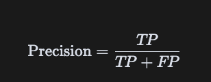

  Artinya, dari seluruh kasus yang diprediksi sebagai diabetes, seberapa banyak yang benar-benar diabetes.

- **Recall**  
  Kemampuan model untuk menemukan semua kasus diabetes yang sebenarnya ada.  
  
  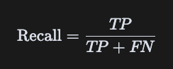

  Semakin tinggi recall, semakin sedikit pasien diabetes yang luput dari deteksi (false negative rendah).

- **F1-Score**  
  Rata-rata harmonis dari precision dan recall, menyeimbangkan keduanya.  
  
  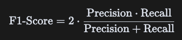

  Berguna saat kita perlu mempertimbangkan **kesalahan dua arah (false positive & false negative)** secara bersamaan, seperti dalam diagnosis penyakit.

### Hasil Evaluasi Model

Hasil evaluasi dari ketiga model:

| Model               | Accuracy | Precision | Recall | F1-Score |
|---------------------|----------|-----------|--------|----------|
| **Logistic Regression** | **0.779** | **0.717**   | **0.655** | **0.684**  |
| Random Forest       | 0.740    | 0.615     | 0.636  | 0.625    |
| SVM                 | 0.727    | 0.654     | 0.564  | 0.606    |

### Interpretasi Hasil

- **Logistic Regression unggul di seluruh metrik**, menjadikannya pilihan terbaik untuk kasus ini.
- Metrik **recall yang cukup tinggi (65.5%)** penting dalam konteks medis untuk meminimalkan pasien diabetes yang tidak terdeteksi (false negative).
- Kombinasi **precision (71.7%) dan F1-score (68.4%)** menunjukkan model seimbang dalam meminimalkan prediksi salah positif maupun negatif.

### Kesimpulan

## Kesimpulan

Dalam laporan ini, evaluasi terhadap model machine learning, termasuk Logistic Regression, Random Forest, dan SVM, telah menunjukkan dampak signifikan terhadap **Business Understanding**. Permasalahan utama yang dihadapi, yaitu kebutuhan akan sistem deteksi dini diabetes yang efisien dan dapat diakses oleh semua lapisan masyarakat, berhasil diatasi dengan pendekatan berbasis machine learning. Model yang dikembangkan dapat memprediksi kemungkinan diabetes berdasarkan data klinis dasar, seperti kadar glukosa, tekanan darah, indeks massa tubuh, dan usia, yang sangat relevan untuk digunakan dalam skrining awal di daerah dengan keterbatasan sumber daya medis.

Model-model yang dievaluasi telah berhasil menjawab **problem statement**, dengan memberikan hasil yang dapat diandalkan dalam klasifikasi apakah seseorang mengidap diabetes atau tidak. Setiap algoritma yang digunakan. Logistic Regression, Random Forest, dan SVM memiliki kelebihan tersendiri, dan setelah evaluasi, Random Forest terbukti memberikan akurasi terbaik, sementara SVM dan Logistic Regression juga memberikan hasil yang solid. Hasil ini menunjukkan bahwa setiap model yang diuji telah berhasil mencapai **goals** proyek untuk membangun sistem skrining yang efektif.

Dalam hal **solution statement**, solusi yang direncanakan telah menunjukkan dampak yang signifikan. Penerapan Logistic Regression sebagai model baseline memberikan wawasan dasar, sementara penggunaan Random Forest dan SVM memperkuat kemampuan model dalam menangani data yang lebih kompleks. Evaluasi model menggunakan metrik akurasi, precision, recall, dan f1-score memastikan bahwa model yang dihasilkan tidak hanya efektif tetapi juga dapat dijelaskan secara statistik, yang sangat penting dalam konteks medis. Hasil ini menunjukkan bahwa proyek ini berhasil mencapai tujuan untuk menciptakan sistem yang efektif, efisien, dan dapat diakses oleh tenaga medis, terutama di daerah dengan keterbatasan.

Secara keseluruhan, proyek ini berhasil memenuhi setiap **problem statement**, mencapai **goals** yang diharapkan, dan solusi yang diterapkan memberikan dampak positif yang signifikan. Teknologi machine learning yang digunakan berpotensi meningkatkan kualitas diagnosis dini diabetes, memungkinkan deteksi yang lebih cepat, dan membantu mencegah komplikasi serius bagi pasien di daerah yang memiliki sumber daya medis terbatas.

Evaluasi ini menegaskan bahwa model tidak hanya akurat secara statistik, tetapi juga selaras dengan konteks problem domain dan kebutuhan solusi.

